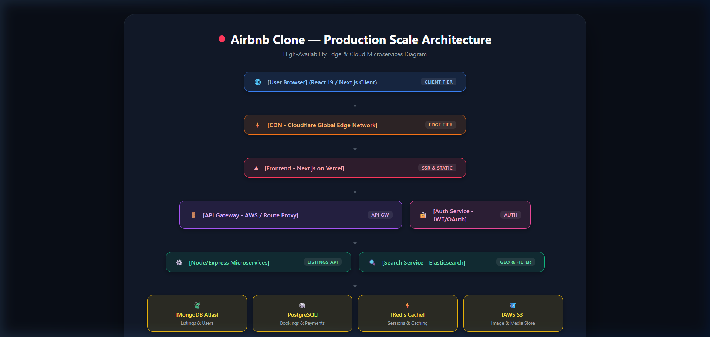

# Airbnb Clone — KriraAI Take-Home Task

**Developer:** Dhruv Solanki  
**Reference:** [https://airbnb-orpin-pi.vercel.app/](https://airbnb-orpin-pi.vercel.app/)  
**Live Demo:** Ready for deployment on Vercel (`client/`)  
**Architecture Diagram:** [`architecture-diagram.png`](./architecture-diagram.png)  

---

## 🚀 Overview

A pixel-perfect, production-grade Airbnb clone built with **React 19**, **Next.js 16 (App Router)**, and **Tailwind CSS**. It replicates the reference Airbnb listing site down to animations, typography, spacing, responsive layouts, and keyboard accessibility.

---

## 📱 Screens Built

### Screen 1 — Home / Listing Page (Primary)
- **Navbar:**
  - Official Airbnb logo SVG in `#FF385C`
  - Interactive tabs: **Homes** (active underline), **Experiences** (`NEW` badge), **Services** (`NEW` badge)
  - Right actions: "Become a host", Globe (Language & Currency modal), User menu pill with hamburger & avatar
- **Search Bar:**
  - Pill-shaped search bar with **Where** (interactive destinations popup), **When** (date range selector), and **Who** (guest counter)
  - Pink search button (`#FF385C`) and search reset filter
- **Listing Carousels:**
  - *"Places to stay in Pune"* with smooth left/right arrow navigation
  - *"Popular homes in North Goa"* with smooth left/right arrow navigation
  - **Listing Card:**
    - 4:3 image carousel with indicator dots and hover pagination arrows
    - "Guest favourite" / "Rare find" badges
    - Heart/save icon with animated bounce and localStorage persistence
    - Price per night and star rating
- **Footer:**
  - 3 columns: Support, Hosting, Airbnb
  - Bottom bar: Legal links, English (IN), ₹ INR, and social icons

### Screen 2 — Photo Tour (Full Screen Gallery)
- Triggered by clicking **"Show all photos"** or any photo on property detail view
- Full screen overlay with sticky header (back navigation, share, save)
- Room category thumbnail navigation:
  - Living room, Full kitchen, Dining area, Bedroom 1, 2, 3, Full bathroom 1, 2, 3, Balcony, Additional photos
  - Clicking any category smoothly scrolls to that room section
- Room details and high-resolution photo grids
- Press **`ESC`** or click back button to close

### Screen 3 — Lightbox (Single Photo Viewer)
- Triggered by clicking any photo in the Photo Tour gallery
- Single high-res photo centered with clean backdrop
- Photo title indicator (e.g. `Living room 1`) and photo counter (e.g. `1 of 23`)
- Circular **Previous (`←`)** and **Next (`→`)** navigation buttons
- **Keyboard Navigation:**
  - **`ArrowLeft` / `ArrowRight`:** Navigate between photos
  - **`Escape`:** Close Lightbox
- Preloading adjacent photos for instant response

---

## 🏗️ Architecture Diagram (Production Scale)



```
[User Browser] (React 19 / Next.js Client)
     │
     ▼
[CDN - Cloudflare Global Edge Network]
     │
     ▼
[Frontend - Next.js on Vercel]
     │
     ├──► [API Gateway - AWS / Route Proxy]
     │         │
     │    ┌────┴────────────────────────┐
     │    ▼                             ▼
     │ [Node/Express Microservices] [Search Service - Elasticsearch]
     │    │
     │    ├──► [MongoDB Atlas] (Listings & Users)
     │    ├──► [PostgreSQL] (Bookings & Payments)
     │    ├──► [Redis Cache] (Sessions & Caching)
     │    └──► [AWS S3] (Image & Media Store)
     │
     └──► [Auth Service - JWT / OAuth 2.0]
```

---

## 💻 Tech Stack

- **Frontend:** Next.js 16 (App Router), React 19, Tailwind CSS v4, Lucide Icons
- **Backend (Bonus):**
  - Next.js Edge REST API: `GET /api/listings`
  - Express.js + Mongoose backend in `backend/`
- **Hooks:** Custom `useKeyboard` hook for accessible keyboard navigation

---

## 🛠️ How to Run Locally

### 1. Frontend (Next.js)
```bash
cd client
npm install
npm run dev
```
Open [http://localhost:3000](http://localhost:3000) in your browser.

### 2. Standalone Backend (Bonus)
```bash
cd backend
npm install
npm run dev
```
Runs Express REST API on `http://localhost:5000/api/listings`.

---

## 🚀 Vercel Deployment

Deploying the frontend to Vercel takes 1 step:
1. Connect this repository to Vercel with Root Directory set to `client`.
2. Build command: `npm run build`
3. Output directory: Next.js default (`.next`)

---

## ✅ Submission Checklist

- [x] Pixel-perfect clone matches reference
- [x] All 3 screens implemented
- [x] Keyboard navigation works (`ESC`, `←`, `→`)
- [x] Architecture diagram included (`architecture-diagram.png`)
- [x] Backend API bonus included (`/api/listings` + `backend/`)
- [x] AI prompts documented (`AI_PROMPTS.md`)
- [x] Code zipped for private submission
